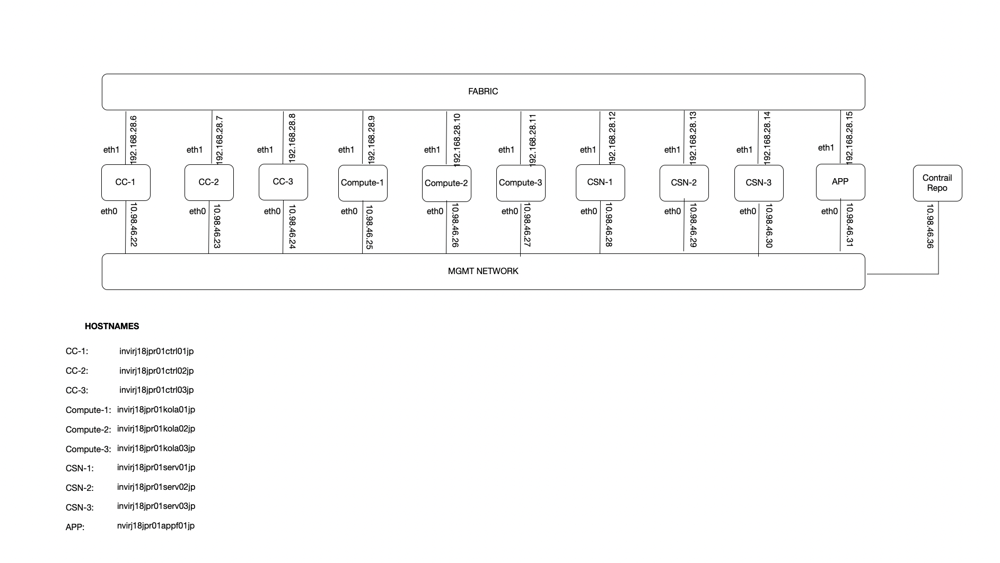

# CEM-HA-INSTALL

This REPO is contains files needed for CEM HA installation. Below is the topology diagram, which depicts the interfaces on the respective VMs and their network connectivity to fabric and management network.

This topology also shows a contrail repo VM, incase the contrail repository has to be built locally.

